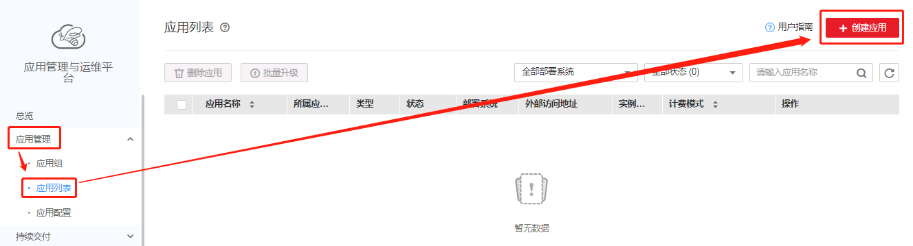
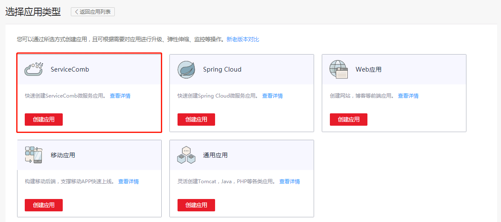
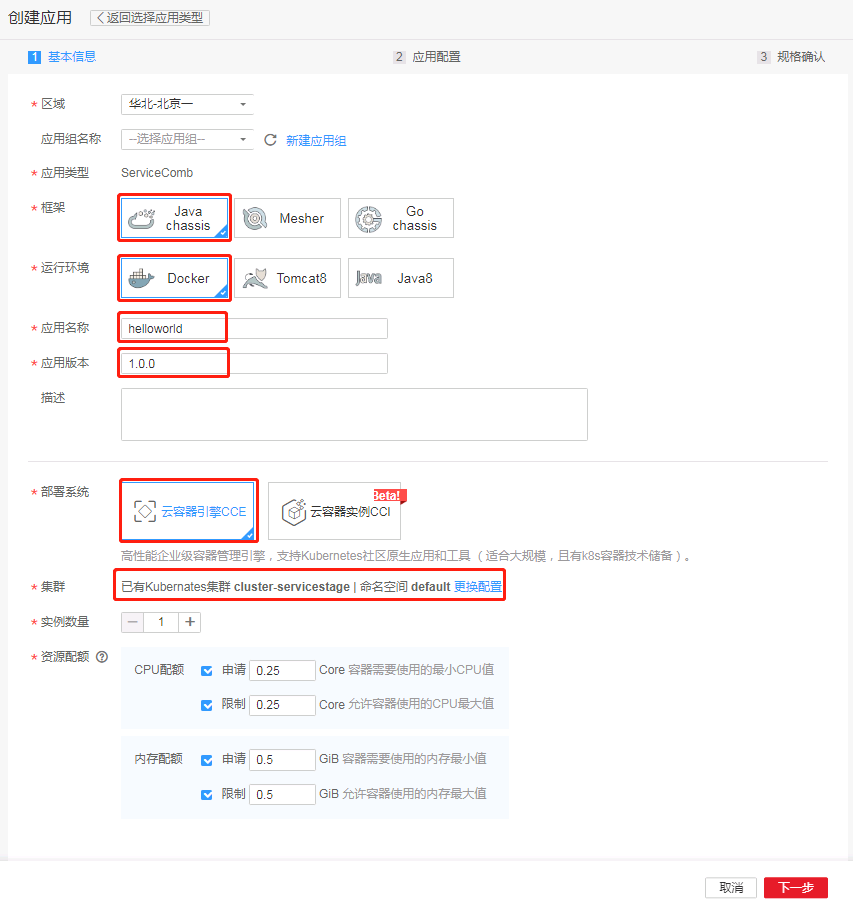
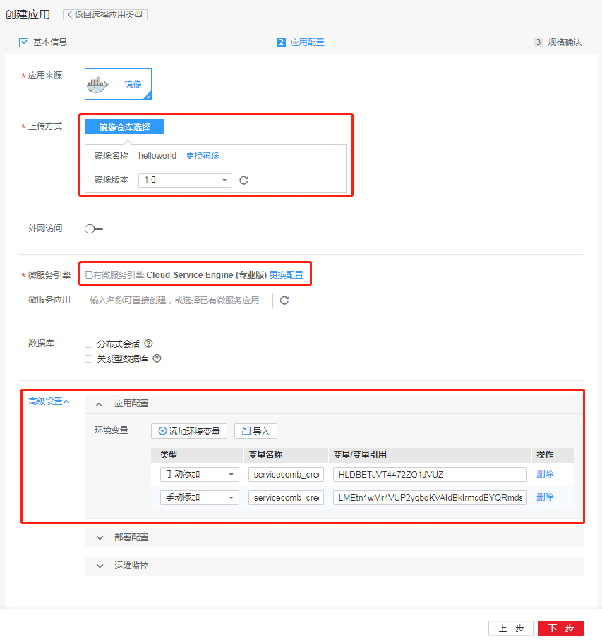
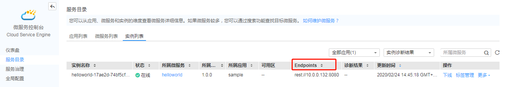

# Java-Chassis 微服务开发部署

Apache ServiceComb Java Chassis 是一个开源的Java微服务开发框架，可以帮助用户快速开发微服务，并提供了一系列开箱即用的特性。本文主要介绍如何将Java-Chassis开发的微服务部署到华为云ServiceStage。

## 前提条件

- 已获取AK/SK，请参考[下载AK/SK](https://support.huaweicloud.com/usermanual-ca/zh-cn_topic_0046606340.html)。
- 已获取项目名，如未获取请参考[查看项目名](https://support.huaweicloud.com/usermanual-ca/zh-cn_topic_0046606344.html)。
- 已了解如何购买ServiceComb微服务引擎且购买了ServiceComb微服务引擎，相关操作请参考购买ServiceComb引擎。
- 熟练掌握Docker使用。
- 了解如何购买CCE，作为部署系统使用，或是直接使用CCI进行部署。

## 本地开发Java-Chassis微服务

> 增加 maven setting 配置方法   http://liubao68.gitee.io/servicecomb-java-chassis-doc/java-chassis/zh_CN/start/development-environment/#maven

请参考Java-Chassis的[开源资料](https://docs.servicecomb.io/java-chassis/zh_CN/start/first-sample/)完成demo开发。完成本地开发后，只需引入少量配置修改即可使用ServiceStage进行部署、托管和运维。

## 修改配置对接ServiceStage

CSE Java SDK 100% 兼容 [ServiceComb Java Chassis](https://github.com/apache/servicecomb-java-chassis)，并对其进行更加友好的封装，更加专注于业务逻辑，以简化用户业务开发。将ServiceComb Java Chassis部署到CSE，并使用CSE提供的能力，只需要对microservice.yaml进行适当的配置，以及在pom中添加额外的依赖，不涉及任何代码修改。

### 引入CSEJavaSDK的依赖包

1. 引入认证鉴权模块

    对接华为云ServiceStage需要引入CSEJavaSDK提供的认证鉴权模块`foundation-auth`，配置如下：
    ```xml
        <dependency>
          <groupId>com.huawei.paas.cse</groupId>
          <artifactId>foundation-auth</artifactId>
          <version>${cse-dependency.version}</version>
        </dependency>
    ```

2. 引入CSE config center客户端（可选）

    如果想要使用动态配置下发或动态治理能力，可以引入配置中心客户端，对接华为云上的CSE config center：
    ```xml
        <dependency>
          <groupId>org.apache.servicecomb</groupId>
          <artifactId>config-cc</artifactId>
        </dependency>
    ```
    该模块已经开源到Apache ServiceComb Java Chassis项目，如果在原有的工程pom文件中已经配置了Java-Chassis的dependencyManagement设置，则这里不再需要单独指明依赖版本。

3. 修改微服务配置

    需要修改的部分如下：
    ```yaml
    servicecomb:
      service:
        registry:
          address: https://cse.cn-north-1.myhuaweicloud.com:443  #将服务中心地址改为华为云上的地址，此处以北京1的专享版CSE引擎为例
          instance:
            watch: false  #如果是使用专享版CSE引擎实例则需要显式指定以pull模式连接服务中心
      config:
        client:
          serverUri: https://cse.cn-north-1.myhuaweicloud.com:443  #将配置中心地址改为华为云上的地址，此处以北京1的专享版CSE引擎为例
          refreshMode: 1
          refresh_interval: 5000
      rest:
        address: 0.0.0.0:8080
      credentials:
        accessKey: your ak  #如果在本地运行则需要在此处配置你的AK
        secretKey: your sk  #如果在本地运行则需要在此处配置你的SK
        project: cn-north-1
        akskCustomCipher: default
    ```

## 部署

### 准备工作
经过上述修改后，Java-Chassis微服务已经可以对接到ServiceStage了。但要在云上部署仍需要进行一些准备工作。

> 修改这部分的描述，改为使用SpringBoot插件打fat jar

1. 将微服务打包成可执行jar包

    Java-Chassis对可执行jar包的打包方式没有限制，这里使用`maven-dependency-plugin`和`maven-jar-plugin`打包，需要在pom中增加如下配置。注意`main.class`属性需要配置成服务的main类。
    ```xml
      <build>
        <plugins>
          <plugin>
            <groupId>org.apache.maven.plugins</groupId>
            <artifactId>maven-dependency-plugin</artifactId>
            <version>2.10</version>
            <executions>
              <execution>
                <id>copy-dependencies</id>
                <phase>package</phase>
                <goals>
                  <goal>copy-dependencies</goal>
                </goals>
                <configuration>
                  <outputDirectory>target/lib</outputDirectory>
                </configuration>
              </execution>
            </executions>
          </plugin>
          <plugin>
            <groupId>org.apache.maven.plugins</groupId>
            <artifactId>maven-jar-plugin</artifactId>
            <version>2.6</version>
            <configuration>
              <archive>
                <manifest>
                  <addClasspath>true</addClasspath>
                  <classpathPrefix>./lib/</classpathPrefix>
                  <mainClass>${main.class}</mainClass>
                  <addDefaultImplementationEntries>true</addDefaultImplementationEntries>
                  <addDefaultSpecificationEntries>true</addDefaultSpecificationEntries>
                </manifest>
                <manifestEntries>
                  <Class-Path>.</Class-Path>
                </manifestEntries>
              </archive>
            </configuration>
          </plugin>
        </plugins>
      </build>
    ```

2. 编写Dockerfile文件

    示例如下，用户也可以根据自身需要进行修改：
    ```dockerfile
    FROM openjdk:8-jdk
    
    WORKDIR /home/apps/
    
    COPY lib lib
    
    COPY *.jar app.jar
    
    RUN sh -c 'touch app.jar'
    
    ENTRYPOINT [ "sh", "-c", "java -Djava.security.egd=file:/dev/./urandom -jar -Xmx128m app.jar" ]
    ```

### 构建docker镜像

1. 构建可执行jar包

    在sample工程根目录执行`mvn clean package`命令。构建完成后可以在target目录下看到微服务可执行jar包和相应的lib目录，将这两部分内容复制到CCE集群的节点上。

2. 构建docker镜像

    在将Dockerfile也复制到CCE集群节点，确保可执行jar包、lib目录、Dockerfile在同一个目录中，如下：
    ```
    [root@cluster-servicestage sample]# ls
    Dockerfile  java-chassis-first-sample-2.0.0.jar  lib
    ```
    
    执行`sudo docker build . -t swr.cn-north-1.myhuaweicloud.com/demo/helloworld:1.0`命令，完成docker镜像构建。
    注意这里打镜像时使用的tag，`swr.cn-north-1.myhuaweicloud.com`是某个region的SWR仓库的地址，`demo`是软件中心的组织名称，`helloworld`是镜像名称，执行操作时请根据你的实际配置修改这些内容。

3. 上传docker镜像

    登录ServiceStage，进入软件中心，通过界面上传，请参考[上传镜像](https://support.huaweicloud.com/usermanual-servicestage/servicestage_user_0187.html)。
    
### 部署应用

1. 登录ServiceStage控制台，点击创建应用，应用类型选择：ServiceComb应用

    
    
    
    
2. 填写基本信息，框架选择`Java Chassis`，运行环境选择`Docker`，应用名称及版本号可根据自己需要进行设置，实例数设置为1即可，其他配置可以保持默认值。

    
    
3. 点击下一步，镜像选择前文上传的`helloworld`镜像，微服务引擎使用默认的专享版CSE引擎即可。如需部署到其他引擎，请先[购买ServiceComb引擎](https://support.huaweicloud.com/usermanual-servicestage/servicestage_user_0140.html#section1)。

    点击高级设置，添加两条环境变量`servicecomb_credentials_accessKey`和`servicecomb_credentials_secretKey`，环境变量的值分别是租户账号的AK和SK，用于对接ServiceComb引擎时进行认证。如需以更安全的方式配置使用AK/SK，可以参考[AK/SK加密存储](https://support.huaweicloud.com/devg-servicestage/cse_03_0088.html)。

    
    
4. 规格确认，提交后开始创建应用，等待其创建完成。

## 验证结果

等待应用部署完成，可以在CSE引擎的服务目录页面看到helloworld服务的记录，其实例数为1



登录节点，使用curl命令调用微服务的endpoint地址，调用成功，即为微服务部署完成。

```
[root@cluster-servicestage ~]# curl http://10.0.0.132:8080/hello
"Hello world!"
```
